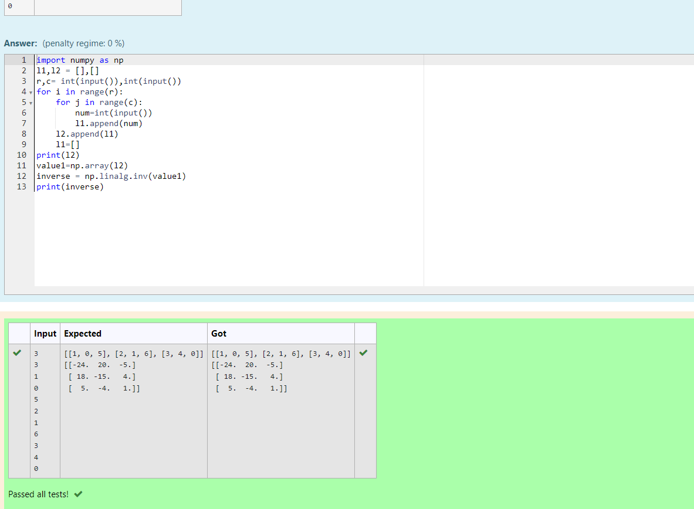

# Inverse-of-matrix

## AIM:
To Write a python program to find the inverse of a nested array.

## ALGORITHM:
### Step 1:
import numpy as np.
### Step 2:
initially put l1 and l2 as zero and mark r,c as inputs
### Step 3:
using for loop in range r and nesting for loop as c
### Step 4:
Mark num as input and write l1.append(num) also l2.append(num)
### Step 5:
make arrays on value1 and use np.linalg.inv ,to find inverse.

## PROGRAM:
~~~
import numpy as np
l1,l2 = [],[]
r,c= int(input()),int(input())
for i in range(r):
    for j in range(c):
        num=int(input())
        l1.append(num)
    l2.append(l1)
    l1=[]
print(l2)
value1=np.array(l2)
inverse = np.linalg.inv(value1)
print(inverse)
~~~

## OUTPUT:

## RESULT:
Hence the inverse of nested array has created.
